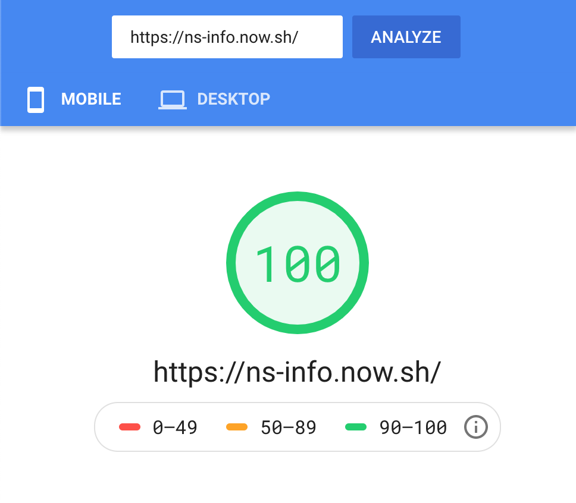
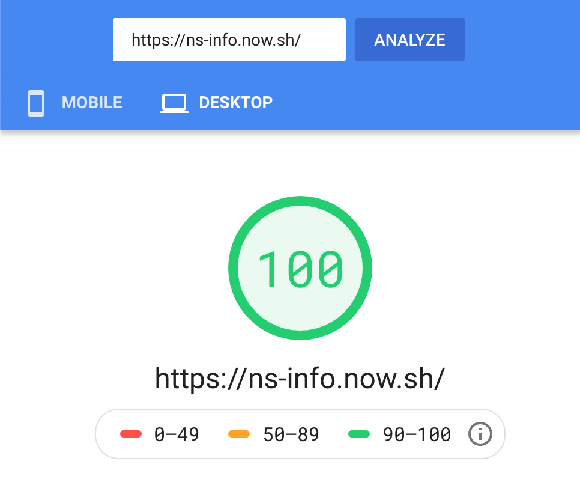
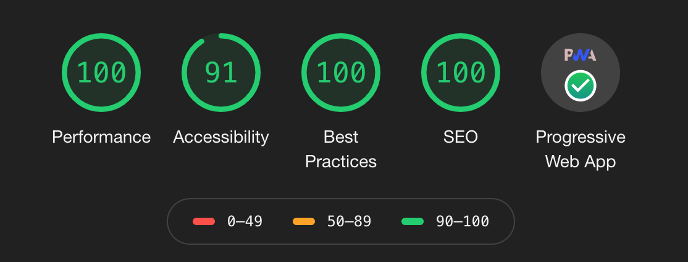
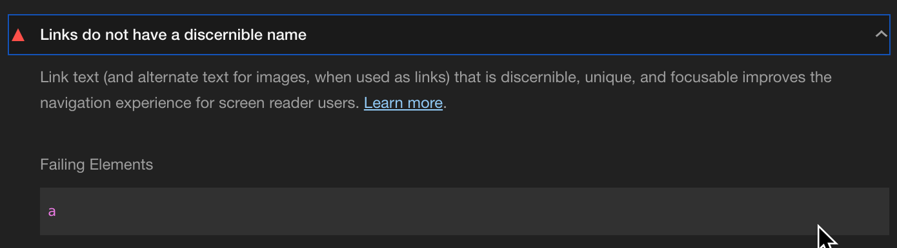
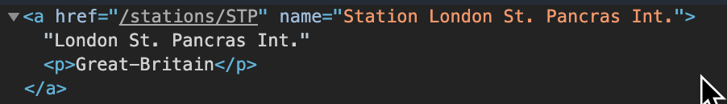

### [Live Demo](https://ns-info.now.sh)

# NS-INFO static site
To improve the performance of [NS-INFO](https://aaraar.github.io/web-app-from-scratch-1920) I created a static site generator.   
Unfortunately the core functionality is somewhat out of the scope I proposed for this project, so it kind of spiraled into something different.
This app is now only a performance playground with mostly just an overview page and detail pages for each station, I did however try and optimize it as much as possible.


### Pagespeed scores
Mobile


Desktop



### Lighthouse scores
Mobile


Desktop


#### Lower accessibility score
This is actually a score that seems to me should be 100.
The error given:

While my anchors do have a name property and a discernible content.
But because there is also a Paragraph tag inside, it seems to deny it, eventhough screenreaders read this perfectly fine


## Table of contents
- [To do](#to-do-)
- [Change of Direction](#change-of-direction)
- [Description](#description-)
- [Installing](#installing-)
- [Packages & Services](#packages--services)
- [API](#api-)
- [How it works](#how-it-works-)
- [Technologies Used](#technologies-used-)
    *[Webpack](#webpack)
    *[Custom Static Asset Generator](#custom-static-asset-generator)
    *[Service Worker](#service-worker)
- [License](#license-)

## To Do 📌
- [x] Set up build tools and deployment pipeline (custom webpack config and personal site generator)
- [X] Added environment modes for production and development (for workflow and ratelimit purposes)
- [x] Statically generate homepage
- [x] Statically generate station page
- [x] Deployed to now.sh
- [x] Added serverless functions to request arrivals and departures (not rendered yet, but active in the console)
- [x] Added static image of each station's location
- [ ] Add more detailed information to each station
- [ ] Progressive Enhance map to be interactive with javascript
- [ ] PE station to add arrivals and departures
- [ ] Create Trips page
- [ ] Create Trip page

## Change of direction
At first I tried to do the app SSR, I did not feel like I was doing anything new or worthwhile though, so I decided to take
a leap and try my hand at generating the site to static HTML files with Node.
I had to start over because of this decision, but the performance benefits up to this point are huge and it's actually really fun to do.

## Description 📝
For the biggest part it's a tech demo/performance playground I created for testing with static generated content.
It contains a lot of train stations in The Netherlands and neighbouring countries, but the content is mostly only available for
the dutch stations. It contains pictures and descriptions of it's facilities and some facilities show their availability. (like parking garages)

Check out the dutch stations in particular, since more data is available to those


## Installing 🔍
To install this application follow these steps:
```
git clone https://github.com/aaraar/progressive-web-apps-1920

cd progressive-web-apps-1920

yarn / npm install
```

- Add the following values to the .env file
    PORT=*Port that the server will be opened on*
    API_KEY_STATIONS=*NS API key with a subscription to 'ns-app*
    API_KEY_TRIPS=*NS API key with a extra subscription rights*
    MAPBOX_TOKEN=*Mapbox api key*
    NODE_ENV=*build mode (optional, will be development on local and production on most deployment services)*

- Set up project on now.sh

- run `now dev`

### Packages & Services
This project makes use of the following tech:

  * [Webpack](https://webpack.js.org/)
  * [Pug](https://pugjs.org/api/getting-started.html)
  * [SASS](https://sass-lang.com/)
  * [ES8 JS](https://tc39.es/ecmascript_sharedmem/shmem.html)
  * [Zeit's now.sh](https://zeit.co/home)

## API 🐒
I made use of the following API for this project:

  * NS Places API
  * NS tripplanner (STATIONS) API

## How It Works 🛠️
Core features of this project.

  * JSON files are generated from the NS API's
  * Images are generated from the mapbox API
  * HTML Files are generated using the aforementioned JSON files and the PUG rendering engine
  * Served on [now.sh](https://ns-info.now.sh)
  
## Technologies Used 🖲
#### Webpack
- Configured own webpack setup for Dev and Prod build modes
- Configured babel loader to work with newer technologies such as a service worker requiring the use of the babel runtime integration
- Assets are content-hashed for file revisions so that max-age headers can be set
- Configured a webpack manifest so that content-hashed assets will be included in the service worker and cache

#### Custom Static Asset Generator
- Data JSON is fetched and saved
- HTML pages are generated based on PUG templates and the JSON files
- Images for each stations location is generated using mapbox static image API (bottom of each station detail page)
- Files are compressed to brotli and gzip at the highest level so that they can be served lightning fast, although the Time-To-First-Byt of Now is not particularly high

#### Service worker
- Caching of core assets including asset revisions
- Different caching strategies for all content types for optimal UX & DX
- Offline mode

## Feedback I would like ⚠️💬
- Content on the stations page
- Progressive enhanced features for the service worker (what to add?)
- What functionality can I add, I'm a little stuck

## License 🔓
MIT © [Bas de Greeuw](https://github.com/aaraar)


<!-- Add a link to your live demo in Github Pages 🌐-->

<!-- ☝️ replace this description with a description of your own work -->

<!-- Add a nice image here at the end of the week, showing off your shiny frontend 📸 -->

<!-- Maybe a table of contents here? 📚 -->

<!-- How about a section that describes how to install this project? 🤓 -->

<!-- ...but how does one use this project? What are its features 🤔 -->

<!-- What external data source is featured in your project and what are its properties 🌠 -->

<!-- Maybe a checklist of done stuff and stuff still on your wishlist? ✅ -->

<!-- How about a license here? 📜 (or is it a licence?) 🤷 -->
